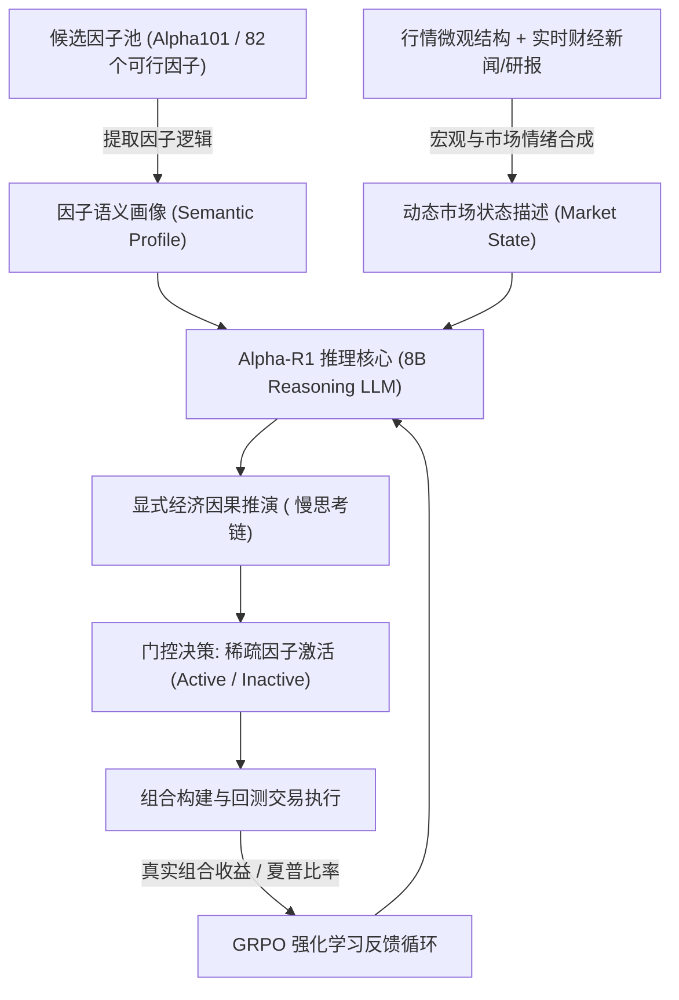

做量化多因子的人，骨子里都刻着一种痛苦：**因子衰减（Alpha Decay）与风格漂移（Regime Shifts）**。

上个季度回测 Sharpe 跑出 2.8、Rank IC 稳定在 8% 以上的“神仙因子”，实盘跑了一个月，遇到一次美联储加息超预期或宏观流动性转向，IC 瞬间掉头变负，甚至成为穿仓的元凶。

传统多因子框架（无论 Barra、Alpha101 还是 LightGBM 暴力拟合）最大的软肋，在于把所有 Alpha 因子降维成了**冰冷的纯数值时间序列**。算法只认历史统计相关性，却完全无法理解：**这个因子究竟为什么能赚钱？它依赖的宏观前提与微观逻辑是什么？当当下市场叙事发生突变时，它还能不能成立？**

财跃星辰（FinStep-AI）联合上海交通大学安泰经管学院花成团队开源的 **Alpha-R1**（论文《Alpha-R1: Alpha Screening with LLM Reasoning via Reinforcement Learning》，arXiv:2512.23515），正是试图用具备长思考链推演能力的 8B 强化学习推理模型，去啃掉这块硬骨头。

本文为你深度拆解 Alpha-R1 的底层逻辑、核心机制以及实盘落地的冷思考。

---

## 1. 核心破局点：从“纯数值拟合”到“语义门控”

传统因子筛选的常见做法，是定期（如月末）根据历史窗口内的 IC、IR、胜率或多空换手进行打分加权。这种方式在平稳行情下尚能运行，但在非平稳（Non-stationary）的真实金融市场中，存在滞后与盲目性。

Alpha-R1 提出的核心解决方案是 **语义门控机制（Semantic Gating）**：



### 什么是因子语义画像？
Alpha-R1 不再把因子视作抽象的代码公式，而是为其建立结构化的**经济学语义说明书**：
- **经济学假设**：该因子是在捕捉均值回归、动量延续、还是流动性溢价？
- **有效市场环境**：在高波动、低波动、高利率还是牛市放量环境中胜率最高？
- **失效边界**：在市场风格发生反转或流动性急剧枯竭时可能引发的风险。

### 动态市场状态对齐
模型实时聚合价格走势数据与高密度财经新闻文本，生成当前的宏观与盘面状态画像。Alpha-R1 在进行门控时，自发推演两者的契合度：
- **激活（Active）**：因子底层逻辑与当前市场环境高度契合；
- **休眠（Inactive）**：因子的经济学前提已被当前市场叙事破坏，主动将其权重置零，避免因滞后性导致亏损。

---

## 2. 强化学习架构：为什么是 GRPO 而非 PPO？

在将大语言模型对齐到金融交易任务时，传统的 RLHF 方法（如 PPO）通常需要一个庞大的 Critic（价值评估网络）。在金融多因子这种超长序列、复杂上下文的场景中，Critic 网络极易过拟合，显存开销倍增且容易出现训练崩塌。

Alpha-R1 汲取了 DeepSeekMath 与 DeepSeek-R1 的前沿经验，全面拥抱 **群组相对策略优化（Group Relative Policy Optimization, GRPO）**。

### GRPO 的数学优势

对于同一组市场上下文输入 $q$，Alpha-R1 会从当前策略网络 $\pi_\theta$ 中同时采样一组（Group）包含 $G$ 个不同的推理输出 $\{o_1, o_2, \dots, o_G\}$。

模型不依赖 Critic 预测绝对分值，而是以该组所有样本的奖励均值和标准差为基准，计算每个推演路径的**相对优势（Relative Advantage）** $A_i$：

$$
A_i = \frac{R_i - \frac{1}{G}\sum_{j=1}^G R_j}{\sqrt{\frac{1}{G}\sum_{j=1}^G \left(R_j - \bar{R}\right)^2 + \epsilon}}
$$

目标函数随后通过带有截断（Clip）和 KL 散度约束的形式进行策略梯度更新：

$$
\mathcal{L}_{\text{GRPO}}(\theta) = -\frac{1}{G}\sum_{i=1}^G \left[ \min\left( \frac{\pi_\theta(o_i|q)}{\pi_{\text{old}}(o_i|q)} A_i, \; \text{clip}\left(\frac{\pi_\theta(o_i|q)}{\pi_{\text{old}}(o_i|q)}, 1-\epsilon, 1+\epsilon\right) A_i \right) - \beta \mathbb{D}_{\text{KL}}(\pi_\theta \parallel \pi_{\text{ref}}) \right]
$$

这种去 Critic 化的设计带来两个质的突破：
1. **极致节省算力**：显存消耗直降 40% 以上，使得 8B 参数模型可以在工业级算力集群上快速迭代长思考链；
2. **避免绝对评分漂移**：金融市场的收益率分布本身具备肥尾与非平稳特征，相对排序（Relative Ranking）比绝对标量打分稳定得多。

---

## 3. 复合奖励体系：让模型学会“真赚钱”而非“嘴炮”

大模型写金融分析文章往往满篇正确的废话，若直接用 LLM 评分容易陷入“幻觉互吹”。Alpha-R1 构建了三重视角咬合的复合 Reward 矩阵：

| 奖励构成模块 | 评价方式 | 核心导向与防止走偏 |
| :--- | :--- | :--- |
| **真实财务回报 (Financial Reward)** | 组合实际年化收益率、夏普比率 (Sharpe Ratio)、Rank IC | **主奖励信号**：对齐硬核量化业绩，杜绝不产生 Alpha 的无用逻辑 |
| **逻辑一致性奖励 (Semantic Consistency)** | 基于高质量规则与 LLM-as-a-Judge 校验推演链 | 惩罚“推导看空价值、最终却激活低估值因子”的逻辑分裂，促发因果合理性 |
| **结构与稀疏性惩罚 (Sparsity Penalty)** | 格式严格约束、因子激活数量正则化 | 强行逼迫模型做**稀疏抉择（Sparse Selection）**，防止模型“全选”来博取平均收益 |

通过这套奖励驱动，Alpha-R1 的 `<think>` 思考链逐渐浮现出资深基金经理的思维特征：不是盲目追高，而是在宏观变奏前夜主动砍掉不合时宜的头寸。

---

## 4. 实证与评测效果：Alpha-R1 真的有用吗？

论文在严格隔离的 12 个月样本外（Out-of-Sample）数据上进行了回测检验，并横跨中美两大最具代表性的权益市场：

### 核心回测指标对比

| 评测维度 / 策略基准 | 标普500 (S&P 500) 年化收益 | 沪深300 (CSI 300) 年化收益 | 最大回撤控制 | 评价重点 |
| :--- | :--- | :--- | :--- | :--- |
| **Alpha-R1 (Semantic Gating + GRPO)** | **47.87%** | **40.57%** | **显著收窄** | 跨市场泛化极强，在 A 股震荡市中防守突出 |
| **全量静态因子等权 (Equal Weight)** | 18.24% | 8.15% | 较大回撤 | 受尾部衰减因子拖累，表现平庸 |
| **传统机器学习回归 (LightGBM/XGBoost)**| 26.40% | 19.30% | 中等 | 遇到宏观突变时响应迟滞，换手摩擦偏高 |
| **无推理能力的普通 LLM (Prompt-only)** | 21.10% | 11.20% | 波动剧烈 | 存在泛化幻觉，无法精准拿捏因子与市场契合度 |

### 典型推理 Chain-of-Thought 切片还原

在一次涉及流动性紧缩与通胀指标上升的典型切片中，Alpha-R1 的内置思考链展现了清晰的因果链条：

```text
<think>
1. 观察当前宏观背景：CPI 超出预期 0.3%，美联储降息预期推迟至四季度，10年期美债收益率攀升至 4.45%；
2. 新闻情绪扫描：科技成长板块出现高管减持与估值过高讨论，宏观流动性边际收紧；
3. 检查因子候选池：
   - Factor_012 (高估值成长动量)：在流动性缩紧周期极易遭遇杀估值双杀，失效率极高 -> 决策：DEACTIVATE (置零)；
   - Factor_045 (自由现金流收益率)：在利率高位震荡期具备显著抗跌属性与防御价值 -> 决策：ACTIVATE；
   - Factor_078 (短期反转)：当前市场波动加剧，反转信号噪音过大，换手损耗不可控 -> 决策：DEACTIVATE；
4. 综合输出稀疏配置组合，聚焦 12 个抗周期与高自由现金流因子。
</think>
```

这种推演不仅让投资决策具备了**毫秒级审计追溯的能力**，彻底甩掉了传统黑盒深度学习“只能看净值，无法解释为什么爆仓”的历史包袱。

---

## 5. 量化实盘冷思考：落地面临的四大工程现实

论文的数据固然惊艳，但把学术模型搬进真实实盘资产管理流水线时，我们必须保持冷静。以下四点是任何量化团队必须直面的现实拷问：

### 1. 推理延迟与算力成本制约
8B 推理模型生成几百个 token 的思考链，单次推理耗时约在数秒至几十秒级别。
- **结论**：Alpha-R1 目前**只适用于日频（Daily）、周频（Weekly）调仓或大类资产宏观择时**，绝无可能直接应用于毫秒级的逐笔行情（Tick-by-Tick）或盘中 T0 撮合。

### 2. 因子频繁开闭诱发的换手率与滑点损耗
语义门控如果对每篇新闻过度敏感，会导致激活的因子子集剧烈晃动，从而使下游股票持仓权重频繁调仓，产生极高的换手率（Turnover Rate）。在考虑双边印花税、佣金与冲击成本后，超额收益很容易被滑点侵蚀。实盘系统中必须在门控层加入**状态转移平滑约束（State Transition Smoothing）**。

### 3. 新闻时间戳与前瞻偏差（Lookahead Bias）
回测中最大的隐蔽死穴是未来函数。财经新闻发布的时间戳、分析师研报的更新时间、与盘前交易决策的截面是否严格对齐？哪怕有 5 分钟的时间戳漂移，也会将一次虚假的信息优势放大为虚高的 Sharpe。

### 4. 极端黑天鹅下的逻辑盲区
大语言模型的语义常识来自于预训练语料。在遭遇 2020 年“负油价”、2024 年初“微盘股流动性踩踏”这种数十年一遇的非线性极限流动性枯竭时，纯文本语义可能无法及时捕捉盘口订单簿（Order Book）中的微观崩塌信号。

---

## 6. 总结：量化 2.0 的范式跃迁

Alpha-R1 的开源（[GitHub: FinStep-AI/Alpha-R1](https://github.com/FinStep-AI/Alpha-R1)），为 AI 与量化交叉领域树立了一个风向标：

量化投资不再是**冷冰冰的算力暴击与无意识统计套利**。通过引入显式经济逻辑推理与 GRPO 强化学习，AI 第一次展现出像专业基金经理一样“阅读市场叙事、理解因子灵魂、顺应宏观变奏”的潜力。

对于量化从业者而言，未来的分水岭或许不再是谁掌握了更复杂的遗传规划公式生成器，而是谁能更早地教会大模型**“像顶尖投研员一样深思，像自律交易员一样执行”**。
