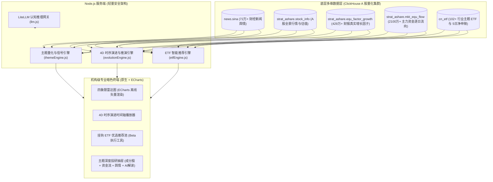

在 A 股做投资，绝大多数亏损并不是因为“选错了赛道”，而是因为**“在共识最拥挤的时候买了单”**。

当一个新兴概念（无论是早先的光伏锂电，还是近期的光模块、低空经济）登上财经热搜、卖方分析师连夜开千人电话会、散户在雪球和股吧里激情转发时，市场的“一致预期”往往已经把未来两三年的业绩利好提前透支。随之而来的，往往是一场惨烈的抱团踩踏与杀估值风暴。

那么，有没有一种系统化的量化工具，能够**跳出人性的狂热，精准识别市场叙事与真实基本面之间的割裂**？

本地量化投研项目 **「共识雷达 (Consensus Radar · AI-Common-Investment)」**，正是针对这个痛点打造的投研分析终端。它基于 ClickHouse 数千万级真实高频数据与大模型推理技术，构建了一套将**市场共识（Consensus）**与**基本面兑现（Fundamentals）**解耦量化的二维象限系统。

本文将带你完整拆解该项目的系统架构、量化打分模型与工程设计精髓。

---

## 1. 核心理论模型：从“一维追涨”到“二维四象限”

传统投资往往只有一维视角——“看多还是看空”、“动量强还是弱”。但这极易踩中“高动量但在山顶”的拥挤陷阱。

共识雷达将每个投资主题拆解为两个正交维度，构建了**二维四象限坐标体系**：

```
                    基本面兑现度 ↑ (Fundamentals)
                          |
      【Q2 潜在机会区】     |      【Q1 共识加速区】
   (低共识 · 高兑现 Alpha)  |   (高共识 · 业绩与情绪共振)
   • 机构持仓低、市场关注低  |   • 订单规模化兑现、分析师上修
   • 订单与财报悄然改善     |   • 景气度投资的主升浪阶段
  ------------------------+------------------------> 市场共识度 (Consensus/Sentiment)
      【Q3 观察等待区】     |      【Q4 拥挤风险区】
   (低共识 · 早期孕育)     |   (高共识 · 估值透支/兑现不足)
   • 技术路线与商业化极早期  |   • 舆情散户极度狂热、成交占比高
   • 等待催化剂与拐点信号   |   • 警惕情绪退潮引发的剧烈杀估值
                          |
```

### 四大象限的买方交易含义

| 象限 | 状态分类 | 核心特征 | 投资决策与交易战术 |
| :--- | :--- | :--- | :--- |
| **Q2** | **早期机会 (Opportunity)** | **低共识 + 高基本面兑现**：冷门但财报增速超预期、订单拐点初现 | **真正的 Alpha 黄金坑**。赔率极高，左侧重仓建仓，静待市场认知修正。 |
| **Q1** | **共识加速 (Forming)** | **高共识 + 高基本面兑现**：业绩放量与市场资金情绪形成正反馈 | **经典景气度投资**。顺势而为，享受主升浪，但需密切监控估值溢价。 |
| **Q4** | **拥挤风险 (Risk)** | **高共识 + 低基本面兑现**：概念满天飞，但财报与主力资金悄然离场 | **坚决回避或逢高止盈**。典型的叙事泡沫，极易遭遇戴维斯双杀。 |
| **Q3** | **观察等待 (Watch)** | **低共识 + 低基本面兑现**：处于产业导入早期，商业化路径不清晰 | **加入观测池**。右侧等待第一笔标志性订单或政策催化剂落地。 |

---

## 2. 系统技术架构：全流程数据流转

整个项目采用了现代量化系统的经典分层架构，全栈不依赖任何重型外部框架，兼顾极致的响应速度与内网离线安全性：



---

## 3. 核心量化打分算法解析

很多所谓的主题投资系统，往往只是停留在打标签（Tagging）层面。而共识雷达的核心突破在于，其象限坐标是通过**严谨的多因子数学模型与底层数千万级行的数据实时计算**得出的。

### 3.1 市场共识度 (Consensus Score) 的量化

共识度代表了市场对该主题的追捧程度与一致看好度，取值范围 $[0, 100]$：

$$
\text{Consensus} = 0.50 \times \text{Prior} + 0.20 \times \text{TurnoverScore} + 0.15 \times \text{FlowScore} + 0.15 \times \text{Heat}
$$

- **投研先验 ($\text{Prior}$)**：由资深研究员设定的基础认知基准；
- **换手率动量 ($\text{TurnoverScore}$)**：抽取主题成分股的日均换手率 $\overline{\text{Turnover}}$，量化资金交易活跃度；
- **主力资金流向 ($\text{FlowScore}$)**：来自 ClickHouse 的 `strat_ashare.mkt_equ_flow`（2100万+ 记录），计算超大单与主力资金的净流入占比：
  $$\text{FlowScore} = \text{clip}\left(50 + \overline{\text{FlowRatio}} \times 150, \; 15, \; 95\right)$$
- **声量热度 ($\text{Heat}$)**：扫描 `news.sina` 中 72 万+ 篇新闻，计算最近 4 周的新闻发稿密度与边际加速度。

### 3.2 基本面兑现度 (Fundamentals Score) 的量化

基本面兑现度代表了行业真实业绩与估值性价比，取值范围 $[0, 100]$：

$$
\text{Fundamentals} = 0.50 \times \text{Prior} + 0.25 \times \text{GrowthScore} + 0.15 \times \text{ValuationScore} + 0.10 \times \text{BreadthScore}
$$

- **财报真实增长因子 ($\text{GrowthScore}$)**：直接关联 `strat_ashare.equ_factor_growth`（429万+ 记录），融合成分股扣非净利润同比增速（$\text{ProfitGrowth}$）与营业收入增速（$\text{RevGrowth}$）：
  $$\text{GrowthScore} = \text{clip}\left(55 + \overline{\text{ProfitGrowth}} \times 70 + \overline{\text{RevGrowth}} \times 25, \; 20, \; 95\right)$$
- **估值合理性 ($\text{ValuationScore}$)**：基于动态市盈率 PE。PE 在 15~40 倍给予估值奖赏；当 PE 超出 120 倍时判定为严重透支，执行严厉扣分；
- **产业链覆盖宽度 ($\text{BreadthScore}$)**：有效覆盖的细分龙头数量与产业纵深占比。

---

## 4. 4D 时序演进：捕捉赛道的时空漂移

一个行业不会永远停留在同一个象限。

**主升浪往往发端于 Q2（早期机会），随后演进到 Q1（共识加速），最终在热度见顶、业绩不及预期时滑向 Q4（拥挤风险）。**

为了捕捉这种动态迁徙，项目构建了 `evolutionEngine.js`，回溯了 2024 至 2026 年各季度的时间锚点：
- **历史轨迹还原**：从 ClickHouse 提取过去 2 年每个时间截面的成分股均价、市盈率、成交量与当期新闻声量；
- **物理运动学拟合**：将每个主题视作二维空间中的一个质点，计算其位移矢量 $\vec{v} = (\Delta x, \Delta y)$ 与加速度，预测其在未来 1~2 个季度的漂移方向；
- **时间轴播放器**：前端支持像视频播放器一样拖动时间轴，直观复盘整个行业板块从“无人问津”到“众声喧哗”的完整生命周期。

```javascript
// 时序动力学推演示例代码 (节选自 evolutionEngine.js)
const dx = pPresent.consensus - pPrev.consensus;
const dy = pPresent.fundamentals - pPrev.fundamentals;
const velocity = Math.sqrt(dx * dx + dy * dy);

// 依据动力学矢量预测下一季度落点
const forecastConsensus = Math.min(96, Math.max(10, Math.round(pPresent.consensus + dx * 0.75)));
const forecastFundamentals = Math.min(96, Math.max(10, Math.round(pPresent.fundamentals + dy * 0.60)));
```

---

## 5. ETF 智能推荐：让 Alpha 落地为可执行的 Beta

很多宏观或主题策略最大的尴尬是“看对了行业，却选错了暴雷的个股”。

共识雷达给出的解法是：**以主题挖掘 Alpha，以 ETF 承接 Beta**。

项目通过 `etfEngine.js` 建立了细分主题与全市场行业主题 ETF（`cn_etf` 数据库）的精准映射：
1. **流动性与规模筛选**：剔除规模低于 2 亿元的迷你 ETF，防止流动性滑点；
2. **5 日资金净申赎监控**：从 `cn_etf.etf_net_redeem` 实时统计机构资金的近 5 日净流入强度；
3. **一键执行池**：当雷达在 Q2 象限扫描到“电网软件”或“大储出海”的预期差信号时，系统直接关联对应的电力 ETF（561380）或储能/电池 ETF（515790），实现从逻辑发现到买入执行的秒级闭环。

---

## 6. 大模型认知推理：从“冷冰冰的数字”到“深思熟虑的研报”

在数据打分与图表渲染之外，项目引入了基于 **LiteLLM** 的深度认知推理层（`llm.js`），支持 DeepSeek、Qwen 等推理大模型。

大模型在系统中承担了三项核心角色：
1. **预期差成因透视**：结合成分股基本面与近期新闻，解答“为什么该行业基本面强劲，但市场共识度却只有 34 分？”（例如分析是否受海外关税情绪误伤、市场偏见等）；
2. **催化剂与风险归纳**：提炼未来 1~2 个季度最具决定性的产业拐点事件；
3. **交互式投研追问**：研究员可以在抽屉侧边栏直接提问：“如果上游原材料价格上涨 15%，该赛道哪家龙头毛利受损最严重？”，大模型会结合当前持仓上下文即时推演作答。

---

## 7. 总结与启示

**AI-Common-Investment (共识雷达)** 展示了一种极具穿透力的量化新范式：

1. **摆脱黑盒拟合**：它没有陷入纯深度学习回归“无法向投资委员会解释”的泥潭，而是用最符合买方直觉的“共识 vs 基本面”四象限，把数千万条高频量化数据降维成直观图景；
2. **多模态与异构数据融合**：将结构化的财务因子（ClickHouse）、半结构化的盘面量价，与非结构化的自然语言新闻（LLM 推理）无缝粘合；
3. **极简工程美学**：没有引入臃肿的前端框架与复杂的微服务，依靠原生 Node.js 与离线 ECharts 跑出了毫秒级响应，展现了专业工程底色。

在量化竞争日趋白热化的今天，或许最丰厚的超额收益，正藏在**“大众尚未形成共识，而基本面已经悄然兑现”**的象限深处。
