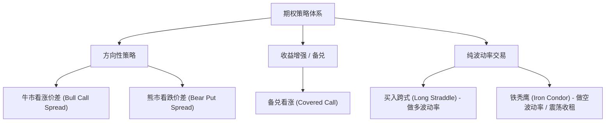

在股票与期货交易中，投资者的损益结构通常是**线性（Linear）**的：买入 1 手现货，价格涨 1 元就赚 1 元，跌 1 元就亏 1 元。

而期权（Options）作为金融工程皇冠上的明珠，彻底打破了线性损益的桎梏。它不仅允许交易者对冲极端的尾部黑天鹅风险，更赋予了量化工程师独立交易**“时间衰减（Theta）”**、**“市场波动率（Vega）”**以及**“曲率变化（Gamma）”**的能力。

本文将为你梳理一份兼顾学术严谨性与实盘工程视角的期权量化学习指南。

---

## 1. 期权定价基石：Black-Scholes-Merton (BSM) 模型

1973 年，费雪·布莱克（Fischer Black）与迈伦·斯科尔斯（Myron Scholes）发表了划时代的期权定价公式。BSM 模型假设标的资产价格服从几何布朗运动（GBM）：

$$
\frac{dS_t}{S_t} = \mu dt + \sigma dW_t
$$

通过无套利对冲原理（构建无风险自融资对冲组合），推导出无红利欧式看涨期权 $C$ 与看跌期权 $P$ 的闭式解析解：

$$
C(S, t) = S_t N(d_1) - K e^{-r(T-t)} N(d_2)
$$

$$
P(S, t) = K e^{-r(T-t)} N(-d_2) - S_t N(-d_1)
$$

其中：

$$
d_1 = \frac{\ln(S_t/K) + \left(r + \frac{1}{2}\sigma^2\right)(T-t)}{\sigma \sqrt{T-t}}, \quad d_2 = d_1 - \sigma \sqrt{T-t}
$$

- $S_t$：当前标的现货价格
- $K$：期权行权价（Strike Price）
- $T-t$：剩余到期年化时间（Time to Maturity）
- $r$：无风险年化利率
- $\sigma$：标的年化波动率（Volatility）
- $N(\cdot)$：标准正态分布的累计概率分布函数

### BSM 的现实边界与隐含波动率
在真实实盘中，标的资产的对数收益率并非理想正态分布，而是普遍存在“尖峰肥尾（Fat Tails）”。如果将市场真实交易价格反推回 BSM 公式，不同行权价算出的 $\sigma$ 并不相等，这便形成了著名的**波动率微笑（Volatility Smile）**或波动率偏斜（Volatility Skew）。

---

## 2. 动态对冲的核心罗盘：四大希腊字母 (The Greeks)

交易期权本质上就是管理由标的价格、时间与波动率构成的多维风险敞口。

| 希腊字母 | 数学定义 | 核心物理意义 | 典型策略偏好 |
| :--- | :--- | :--- | :--- |
| **Delta ($\Delta$)** | $\frac{\partial V}{\partial S}$ | 标的价格每变动 1 单位，期权价值变动的绝对幅度；亦可近似为到期行权概率 | 趋势追踪、Delta 中性对冲 |
| **Gamma ($\Gamma$)** | $\frac{\partial^2 V}{\partial S^2} = \frac{\partial \Delta}{\partial S}$ | Delta 随标的价格变动的加速度；期权非线性凸性的来源 | 买方博弈暴涨暴跌；卖方防范穿仓 |
| **Theta ($\Theta$)** | $\frac{\partial V}{\partial t}$ | 随时间流逝，期权价值每天自然衰减的金额（通常为负值） | 卖方收割时间价值的最佳盟友 |
| **Vega ($\mathcal{V}$)** | $\frac{\partial V}{\partial \sigma}$ | 隐含波动率每上升 1% 时，期权价格变动的幅度 | 波动率事件套利、财报前做多 IV |

### Greeks 的微积分纽带
根据 BSM 偏微分方程，在无红利情况下满足：

$$
\Theta + \frac{1}{2}\sigma^2 S^2 \Gamma + rS\Delta = rV
$$

**核心直觉启示**：$\Theta$ 与 $\Gamma$ 互为硬币的两面。如果你想要拥有正 Gamma（享受大行情带来的非线性暴利），你就必须每天向市场支付时间价值（负 Theta）；反之，如果你想要躺着收割时间价值（正 Theta），你就必须承担被极端行情重创的负 Gamma 风险。

---

## 3. 四大经典期权策略结构



### 策略 1：备兑看涨策略 (Covered Call)
- **构建方式**：持有 100 股标的现货 + 卖出 1 张虚值看涨期权（OTM Call）。
- **适用场景**：对标的长期看好，但预期短期内窄幅震荡或温和上涨。
- **优缺点**：放弃上方暴涨收益，锁定权利金收入作为底仓防御安全垫。

### 策略 2：垂直价差组合 (Vertical Spread)
- **典型代表**：牛市看涨价差（买入行权价低的 Call $K_1$，卖出行权价高的 Call $K_2$）。
- **核心逻辑**：单买 Call 面临高额 Theta 磨损；通过卖出更虚值的 Call，大幅拉低持仓成本，并将盈亏上下限明确锁定。

### 策略 3：跨式组合 (Straddle)
- **构建方式**：同时买入相同到期日、相同行权价的平值 Call 与 Put。
- **适用场景**：重大宏观数据公布、重组定增、医药 FDA 审批或财报季前夕。
- **盈亏特征**：不猜方向，只要标的大涨或大跌幅度超过双向付出的权利金总和，即可获利。

### 策略 4：铁秃鹰组合 (Iron Condor)
- **构建方式**：卖出一组宽跨式（OTM Put + OTM Call），并在更外侧各买入一张更深虚值的期权作为保护。
- **适用场景**：预期标的在特定区间内窄幅横盘，赚取确定性的时间价值衰减与波动率回归。

---

## 4. Python 生产级计算代码：BSM 定价与希腊字母计算器

以下为基于 `scipy.stats` 实现的向量化期权定价与全套希腊字母计算引擎：

```python
import numpy as np
from scipy.stats import norm

class BSMOptionPricer:
    """
    Black-Scholes-Merton 欧式期权定价与希腊字母计算引擎
    """
    def __init__(self, S: float, K: float, T: float, r: float, sigma: float):
        """
        :param S: 标的现货价格
        :param K: 行权价格
        :param T: 距到期剩余年化时间 (如 30天 = 30 / 365)
        :param r: 无风险利率 (如 2% = 0.02)
        :param sigma: 年化隐含波动率 (如 25% = 0.25)
        """
        self.S = float(S)
        self.K = float(K)
        self.T = max(1e-5, float(T)) # 防止除以 0
        self.r = float(r)
        self.sigma = max(1e-5, float(sigma))
        
        self._calculate_d1_d2()

    def _calculate_d1_d2(self):
        sqrt_T = np.sqrt(self.T)
        self.d1 = (np.log(self.S / self.K) + (self.r + 0.5 * self.sigma ** 2) * self.T) / (self.sigma * sqrt_T)
        self.d2 = self.d1 - self.sigma * sqrt_T

    def price(self, option_type: str = 'call') -> float:
        """计算期权理论价格"""
        if option_type.lower() == 'call':
            return self.S * norm.cdf(self.d1) - self.K * np.exp(-self.r * self.T) * norm.cdf(self.d2)
        elif option_type.lower() == 'put':
            return self.K * np.exp(-self.r * self.T) * norm.cdf(-self.d2) - self.S * norm.cdf(-self.d1)
        raise ValueError("option_type 必须为 'call' 或 'put'")

    def delta(self, option_type: str = 'call') -> float:
        """标的价格敏感度"""
        if option_type.lower() == 'call':
            return norm.cdf(self.d1)
        elif option_type.lower() == 'put':
            return norm.cdf(self.d1) - 1.0
        raise ValueError("option_type 必须为 'call' 或 'put'")

    def gamma(self) -> float:
        """Delta 加速度 (看涨看跌相等)"""
        return norm.pdf(self.d1) / (self.S * self.sigma * np.sqrt(self.T))

    def theta(self, option_type: str = 'call') -> float:
        """单日时间流逝衰减金额 (1日)"""
        term1 = - (self.S * norm.pdf(self.d1) * self.sigma) / (2 * np.sqrt(self.T))
        if option_type.lower() == 'call':
            term2 = - self.r * self.K * np.exp(-self.r * self.T) * norm.cdf(self.d2)
        else:
            term2 = self.r * self.K * np.exp(-self.r * self.T) * norm.cdf(-self.d2)
        # 年化 Theta 折算到每个自然日
        return (term1 + term2) / 365.0

    def vega(self) -> float:
        """波动率每上升 1% (0.01) 的价格变化"""
        return (self.S * norm.pdf(self.d1) * np.sqrt(self.T)) * 0.01

# 示例验证：沪深300 ETF 平值期权测试
if __name__ == '__main__':
    pricer = BSMOptionPricer(S=4.0, K=4.0, T=30/365, r=0.02, sigma=0.20)
    print(f"看涨理论价: {pricer.price('call'):.4f}")
    print(f"看跌理论价: {pricer.price('put'):.4f}")
    print(f"Call Delta: {pricer.delta('call'):.4f}")
    print(f"Gamma:      {pricer.gamma():.4f}")
    print(f"单日 Theta: {pricer.theta('call'):.4f}")
    print(f"Vega (1%):  {pricer.vega():.4f}")
```

---

## 5. 期权实盘量化避坑指南

1. **警惕波动率崩塌（IV Crush）**：
   在财报公布或重大政治事件落地后，不确定性消散，隐含波动率往往出现断崖式暴跌（IV 从 80% 跌至 25%）。此时即便标的方向做对了，买入看涨期权也可能因 Vega 损失导致严重亏损。
2. **临近到期日的“Gamma 穿仓风暴”**：
   平值期权在临近到期前几天，Gamma 会趋向无穷大。微小的标的异动就会让 Delta 从 0 瞬间跳跃到 1，导致卖方敞口来不及对冲造成爆仓。实盘建议在到期前 7~10 天主动展期（Roll）。
3. **真实交易滑点与流动性损耗**：
   期权不同行权价合约流动性分化极大。远月深度虚值合约往往存在高达 5%~10% 的买卖价差（Bid-Ask Spread），回测中若不考虑冲击成本，策略实盘表现将大打折扣。
